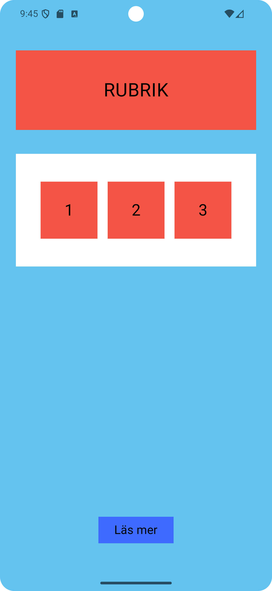

# PiaAndroidUppgift1

Android assignment built using **Kotlin** and **Jetpack Compose**.

This project demonstrates a simple Android application with navigation between two screens.

---

## Features

- Built with **Jetpack Compose**
- Simple UI layout
- Navigation between screens
- Android Emulator compatible
- Clean project structure

---

## Screenshots

### Main Screen

### Read More Screen

---

## Technologies Used

- Kotlin
- Jetpack Compose
- Android Studio
- Navigation Compose

---

## How to Run the Project

1. Clone the repository
